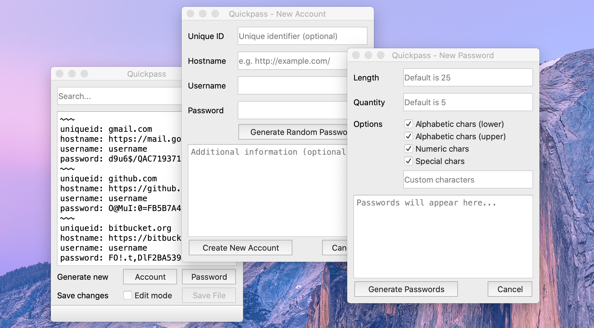

# QuickPass

Cross-platform and minimalistic password manager written in C++ and Qt5.

The application offers a simple user interface to allow users to insert, search and generate account credentials, including their passwords. The project serves as a starting point for more advanced password managers. Feel free to copy the code, modify it, and add more features as you see fit.

### Features

* Read and parse text/plain files
* In-line file content edition
* Switch between edit modes
* Search text wrapped around a common string
* Search multiple blocks with the same matching text
* New account information generator
* Customizable password generator
* Random password generator for new account
* Random password generator with custom data

### TODO

* Account file encryption.
* Backup once edit mode is enabled.
